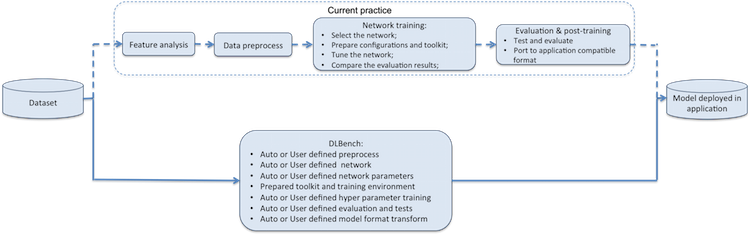

# DLBundle
DLBundle is an End-to-End Deep Learning solution, which takes in raw or processed data and outputs the trained models. The motivation is to save the engineering effort of developers on choosing and tuning different networks for different usage senarios.

